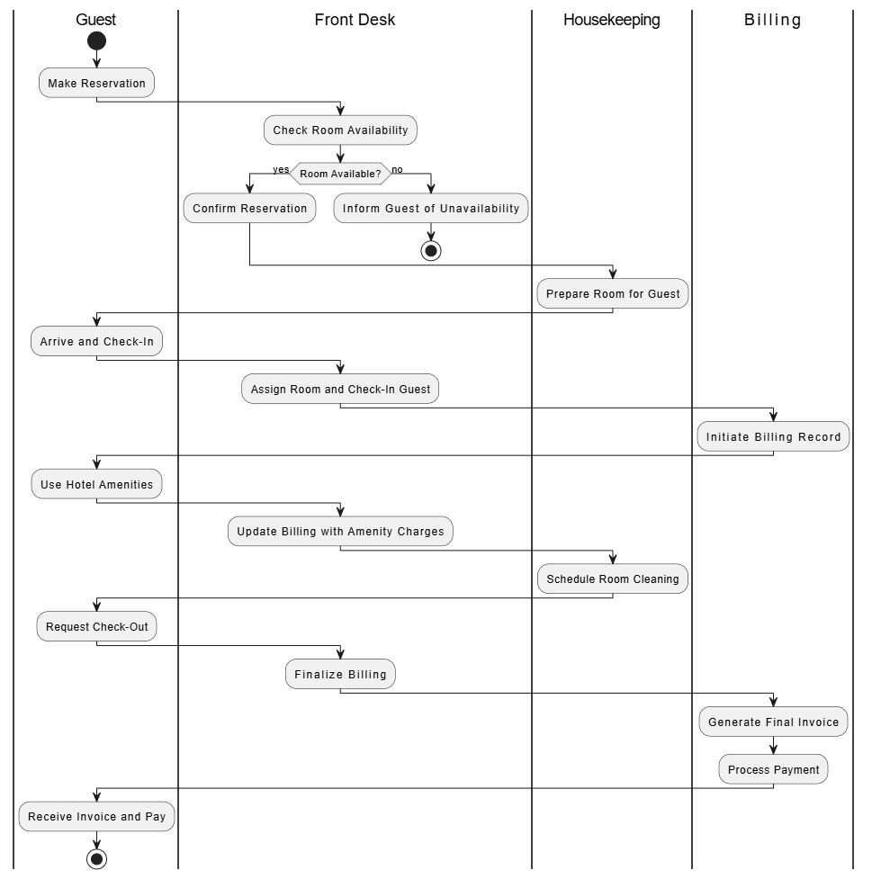

# HOTEL MANAGEMENT SYSTEM

## Problem Statement:
In the hospitality industry, hotels face challenges in managing guest services efficiently due to disconnected processes and manual management of reservations, check-ins, billing, and housekeeping. This fragmented approach often results in booking errors, inconsistent billing, and delayed services, leading to customer dissatisfaction and operational inefficiencies. A comprehensive, centralized Hotel Management System (HMS) is needed to streamline operations, reduce human errors, and improve guest experience by automating bookings, room assignments, billing, and resource management, while providing real-time insights to support data-driven decisions for hotel management.

## Objectives
- Automate and Centralize Booking Management
- Enhance Guest Experience
- Optimize Resource Management
- Enable Data-Driven Decision-Making

## Main Entities
- Guests
- Rooms
- Reservations
- Staff
- Billing
- Inventory

## Expected outcomes of the database solution
- Seamless and error-free bookings
- Enhanced operational efficiency
- Consistent and accurate billings
- Optimized resource allocation
- Informed Decision-making
---
# Swimlane
## Overview
This swimlane diagram models the Hotel Management System process, from guest reservation through check-out. The process emphasizes interactions among the *Guest*, *Front Desk*, *Housekeeping*, and *Billing* departments, incorporating a decision point for room availability.

## Swimlanes and Their Roles

### 1. Guest 
Acts as the primary user of hotel services, initiating the reservation process, checking in, enjoying the amenities, and completing payment at check-out.
### 2. Front Desk
Oversees key operational tasks, including managing room availability, confirming reservations, checking in guests, assigning rooms, updating bills for any additional charges, and ensuring a smooth check-out process.
### 3. Housekeeping
Plays a vital role in guest satisfaction by preparing rooms for check-in, performing regular cleaning during the stay, and responding to specific cleaning requests.
### 4. Billing
Ensures accurate financial transactions by creating and maintaining billing records, generating the final invoice, and processing payments efficiently during check-out.
In a well-coordinated hospitality system, these roles work in tandem to deliver a seamless experience for guests while maintaining operational efficiency.

## Step-by-Step Flow Description with Decision Point
**1. Guest Makes a Reservation**

**2. Front Desk Checks Room Availability**

**3. Decision: Room Availability Check**

**4. Front Desk Confirms Reservation**

**5. Housekeeping Prepares Room for Guest**

**6. Guest Arrives and Checks In**

**7. Front Desk Assigns Room and Checks In Guest**

**8. Billing Initiates Billing Record**

**9. Guest Uses Hotel Amenities**

**10. Front Desk Updates Billing with Amenity Charges**

**11. Housekeeping Schedules Room Cleaning**

**12. Guest Requests Check-Out**

**13. Front Desk Finalizes Billing**

**14. Billing Generates Final Invoice**

**15. Guest Receives Invoice and Pays**

## Purpose and Benefits
This swimlane diagram clarifies roles and responsibilities within the hotel management workflow, ensuring smooth guest experiences and efficient departmental coordination. Key benefits include:
- **Billing Accuracy**
  The decision point ensures accurate room availability during booking, preventing overbookings and streamlining guest check-in.
- **Efficient Room Turnover**
  Updating room status after check-out aids housekeeping in managing room readiness.
- **Enhanced Guest Experience**
  Collecting feedback from guests supports ongoing service improvements, promoting overall satisfaction.
  ---
# Table Creation
The table were created in the database for each entity and below are the commands used for table creation

## Guests Table
```sql
CREATE TABLE Guests (
    guest_id NUMBER NOT NULL PRIMARY KEY,
    first_name VARCHAR2(20) NOT NULL,
    last_name VARCHAR2(20) NOT NULL,
    email VARCHAR2(100) UNIQUE,
    phone_number VARCHAR2(20) NOT NULL,
    address VARCHAR2(255)
);
```

## Rooms Table
```sql
CREATE TABLE Rooms (
    room_id NUMBER NOT NULL PRIMARY KEY,
    room_number VARCHAR2(20) NOT NULL UNIQUE,
    room_type VARCHAR2(20) NOT NULL,
    price_per_night NUMBER(10, 2) NOT NULL,
    availability_status NUMBER(1) DEFAULT 1 NOT NULL,
    max_occupancy NUMBER NOT NULL
);
```

## Reservation Table

```sql
CREATE TABLE Reservation (
    reservation_id NUMBER NOT NULL PRIMARY KEY,
    guest_id NUMBER NOT NULL,
    room_id NUMBER NOT NULL,
    check_in_date DATE NOT NULL,
    check_out_date DATE NOT NULL,
    reservation_status VARCHAR2(20) DEFAULT 'Pending',
    FOREIGN KEY (guest_id) REFERENCES Guests(guest_id),
    FOREIGN KEY (room_id) REFERENCES Rooms(room_id)
);
```

## Staff Table

```sql
CREATE TABLE Staff (
    staff_id NUMBER NOT NULL PRIMARY KEY,
    first_name VARCHAR2(20) NOT NULL,
    last_name VARCHAR2(20) NOT NULL,
    position VARCHAR2(20) NOT NULL,
    email VARCHAR2(100) NOT NULL UNIQUE,
    phone_number VARCHAR2(20) NOT NULL,
    assigned_room_id NUMBER,
    FOREIGN KEY (assigned_room_id) REFERENCES Rooms(room_id)
);
```

## Billing Table

```sql
CREATE TABLE Billing (
    billing_id NUMBER NOT NULL PRIMARY KEY,
    reservation_id NUMBER NOT NULL,
    amount NUMBER(10, 2) NOT NULL,
    payment_status VARCHAR2(20) DEFAULT 'Pending',
    payment_method VARCHAR2(20),
    FOREIGN KEY (reservation_id) REFERENCES Reservation(reservation_id)
);
```

## Inventor Table

```sql
CREATE TABLE Inventory (
    item_id NUMBER NOT NULL PRIMARY KEY,
    item_name VARCHAR2(20) NOT NULL,
    quantity NUMBER DEFAULT 0 NOT NULL,
    reorder_level NUMBER NOT NULL
);
```
---
# ERD Of The Project


# Advanced Database Programming and Auditing
---
## Problem statement Development

The Hotel Management System (HMS) requires advanced database programming to efficiently manage complex operations, such as real-time room availability tracking, automated reservation handling, and dynamic billing processes. The system must handle high volumes of concurrent transactions, ensure data integrity across multiple entities (e.g., guests, rooms, reservations, payments), and support scalability for future growth. Advanced programming techniques, such as stored procedures, triggers, and constraints, are essential to automate workflows, enforce business rules, and optimize query performance, ultimately improving operational efficiency and guest satisfaction.

## Trigger Implementation

## Simple Trigger
---

### Scenario:
Prevent Double Bookings
### Business Rule:
A room cannot have overlapping reservations.
### Trigger Type:
BEFORE INSERT OR UPDATE trigger.

```sql
-- A trigger to prevent double booking

CREATE OR REPLACE TRIGGER prevent_double_booking
BEFORE INSERT OR UPDATE ON Reservation
FOR EACH ROW
DECLARE
    overlapping_count NUMBER;
BEGIN
    SELECT COUNT(*)
    INTO overlapping_count
    FROM Reservation
    WHERE room_id = :NEW.room_id
      AND :NEW.check_in_date < check_out_date
      AND :NEW.check_out_date > check_in_date
      AND reservation_status = 'CONFIRMED';

    IF overlapping_count > 0 THEN
        RAISE_APPLICATION_ERROR(-20001, 'Room is already booked for the selected dates.');
    END IF;
END;
/
```

## Compound Trigger
---

### Scenario:
Checking Room Availability
### Business Rule:
When a guest checks in or checks out, the availability_status of the room should automatically update to reflect its current state.
### Trigger Type:
AFTER INSERT OR UPDATE trigger.

```sql
create or replace TRIGGER room_availability
FOR INSERT OR UPDATE OR DELETE ON Reservation
COMPOUND TRIGGER

    -- Declare a collection to track affected room IDs
    TYPE t_room_ids IS TABLE OF Rooms.room_id%TYPE;
    v_room_ids t_room_ids := t_room_ids();

    -- BEFORE EACH ROW: Collect affected room IDs
    BEFORE EACH ROW IS
    BEGIN
        IF INSERTING THEN
            v_room_ids.EXTEND;
            v_room_ids(v_room_ids.LAST) := :NEW.room_id;
        ELSIF UPDATING THEN
            v_room_ids.EXTEND;
            v_room_ids(v_room_ids.LAST) := :OLD.room_id; -- Old room ID
            IF :NEW.room_id != :OLD.room_id THEN
                v_room_ids.EXTEND;
                v_room_ids(v_room_ids.LAST) := :NEW.room_id; -- New room ID
            END IF;
        ELSIF DELETING THEN
            v_room_ids.EXTEND;
            v_room_ids(v_room_ids.LAST) := :OLD.room_id;
        END IF;
    END BEFORE EACH ROW;

    -- AFTER STATEMENT: Update room availability status
    AFTER STATEMENT IS
    BEGIN
        -- Loop through all affected room IDs
        FOR i IN v_room_ids.FIRST .. v_room_ids.LAST LOOP
            -- Check if the room has any active reservation
            DECLARE
                v_active_reservations NUMBER;
            BEGIN
                SELECT COUNT(*)
                INTO v_active_reservations
                FROM Reservation
                WHERE room_id = v_room_ids(i)
                  AND reservation_status = 'CONFIRMED';

                -- Update the availability status of the room
                IF v_active_reservations > 0 THEN
                    UPDATE Rooms
                    SET availability_status = 0 -- Unavailable
                    WHERE room_id = v_room_ids(i);
                ELSE
                    UPDATE Rooms
                    SET availability_status = 1 -- Available
                    WHERE room_id = v_room_ids(i);
                END IF;
            END;
        END LOOP;
    END AFTER STATEMENT;

END room_availability;
/
```

## Cursor Usage

### Scenarios for Explicit Cursors in HMS
#### Scenario 1: Generate Monthly Billing Statements
*Use Case*

  For each guest with confirmed reservations during a specific month, calculate their total bill, including room charges, additional services, and applicable taxes, and send the billing details to an accounting table.
  
*Why Use Cursors?*

  The process requires iterating through each guest's reservations and performing calculations for each row.

### Scenario 2: Expire Old Reservations

*Use Case*

  Identify and update all reservations where the check-in date has passed, but the status is still "Pending." Mark these reservations as "Expired."

*Why Use Cursors?*

  Row-by-row updates are necessary to handle reservations individually while maintaining an audit trail.

### Scenario 3: Notify Guests About Upcoming Reservations

*Use Case*

  Iterate through reservations where the check-in date is within the next 7 days and send email notifications to guests.

*Why Use Cursors?*

  Each reservation requires a personalized notification to be sent for every row.

```sql
-- Explicit cursors
-- Expire Old Reservations

DECLARE
    CURSOR cur_pending_Reservation IS
        SELECT reservation_id, guest_id, room_id, check_in_date
        FROM Reservation
        WHERE reservation_status = 'Pending' AND check_in_date < SYSDATE;

    v_reservation_id Reservation.reservation_id%TYPE;
    v_guest_id Reservation.guest_id%TYPE;
    v_room_id Reservation.room_id%TYPE;
    v_check_in_date Reservation.check_in_date%TYPE;
BEGIN
    -- Open the cursor
    OPEN cur_pending_Reservation;

    -- Loop through each record in the cursor
    LOOP
        FETCH cur_pending_Reservation INTO v_reservation_id, v_guest_id, v_room_id, v_check_in_date;
        EXIT WHEN cur_pending_Reservation%NOTFOUND;

        -- Update the reservation status to 'Expired'
        UPDATE Reservation
        SET reservation_status = 'Expired'
        WHERE reservation_id = v_reservation_id;
    END LOOP;

    -- Close the cursor
    CLOSE cur_pending_Reservation;
END;
/


DECLARE
    -- Cursor to fetch upcoming reservations
    CURSOR cur_upcoming_reservations IS
        SELECT r.reservation_id, g.guest_id, g.email, r.check_in_date
        FROM Reservation r
        JOIN Guests g ON r.guest_id = g.guest_id
        WHERE r.reservation_status = 'CONFIRMED'
          AND r.check_in_date BETWEEN SYSDATE AND SYSDATE + 7;

    -- Variables to hold fetched data
    v_reservation_id Reservation.reservation_id%TYPE;
    v_guest_id Guests.guest_id%TYPE;
    v_email Guests.email%TYPE;
    v_check_in_date Reservation.check_in_date%TYPE;
BEGIN
    -- Open the cursor
    OPEN cur_upcoming_reservations;

    -- Loop through each row in the cursor
    LOOP
        FETCH cur_upcoming_reservations INTO v_reservation_id, v_guest_id, v_email, v_check_in_date;

        -- Exit the loop when no more rows are found
        EXIT WHEN cur_upcoming_reservations%NOTFOUND;

        -- Send a notification to the guest (mocked as DBMS_OUTPUT in this case)
        DBMS_OUTPUT.PUT_LINE('Notification sent to: ' || v_email || 
                             ' for reservation ID: ' || v_reservation_id || 
                             ', Check-in Date: ' || v_check_in_date);
    END LOOP;

    -- Close the cursor
    CLOSE cur_upcoming_reservations;

    DBMS_OUTPUT.PUT_LINE('Notifications for upcoming reservations have been sent.');
END;
/
```

## Using Attributes %TYPE and `%ROWTYPE
*What Are They?*

%TYPE: Links a variable’s data type to the data type of a specific column in a table. If the column’s type changes, the variable automatically adapts.

%ROWTYPE: Links a record variable to a table or cursor’s structure. It contains all the columns of that table or cursor.

## Use of %TYPE

```sql
SET SERVEROUTPUT ON;
DECLARE
    v_room_price Rooms.price_per_night%TYPE; -- Adapts to the data type of Rooms.price_per_night
    v_total_cost NUMBER;
    v_reservation_id Reservation.reservation_id%TYPE;
BEGIN
    SELECT price_per_night
    INTO v_room_price
    FROM Rooms
    WHERE room_id = 1; -- Example room ID

    -- Calculate the total cost for 5 nights
    v_total_cost := v_room_price * 5;

    DBMS_OUTPUT.PUT_LINE('Total Cost for 5 nights: ' || v_total_cost);
END;
/
```

## Use of %ROWTYPE
```sql
SET SERVEROUTPUT ON;
DECLARE
    v_reservation Reservation%ROWTYPE; -- Record variable with all columns from the Reservations table
BEGIN
    SELECT *
    INTO v_reservation
    FROM Reservation
    WHERE reservation_id = 1; -- Example reservation ID

    -- Process the reservation details
    DBMS_OUTPUT.PUT_LINE('Reservation Details: Guest ID: ' || v_reservation.guest_id ||
                         ', Room ID: ' || v_reservation.room_id ||
                         ', Check-In: ' || v_reservation.check_in_date ||
                         ', Check-Out: ' || v_reservation.check_out_date);
END;
/
```

## Function

```sql
create or replace FUNCTION calculate_total_bill(
    p_reservation_id IN Reservation.reservation_id%TYPE
) RETURN NUMBER IS
    v_room_price Rooms.price_per_night%TYPE;
    v_nights NUMBER;
    v_total_cost NUMBER;
    v_tax_rate CONSTANT NUMBER := 0.15; -- Example tax rate (15%)
BEGIN
    -- Fetch room price and calculate nights stayed
    SELECT r.price_per_night, (res.check_out_date - res.check_in_date)
    INTO v_room_price, v_nights
    FROM Reservation res
    JOIN Rooms r ON res.room_id = r.room_id
    WHERE res.reservation_id = p_reservation_id;

    -- Calculate total cost
    v_total_cost := (v_room_price * v_nights) * (1 + v_tax_rate);

    RETURN v_total_cost;
END;

-- Function calling
SET SERVEROUTPUT ON;
DECLARE
    v_total_bill NUMBER;
BEGIN
    -- Call the function
    v_total_bill := calculate_total_bill(1); -- Example reservation ID
    DBMS_OUTPUT.PUT_LINE('Total Bill: ' || v_total_bill);
END;
/
```

## Packages

```sql
CREATE OR REPLACE PACKAGE BODY Reservation_Pkg AS

    -- Procedure to Create a Reservation
    PROCEDURE create_reservation(
        p_guest_id IN Guests.guest_id%TYPE,
        p_room_id IN Rooms.room_id%TYPE,
        p_check_in_date IN DATE,
        p_check_out_date IN DATE
    ) IS
    BEGIN
        -- Check if the room is available
        IF NOT check_room_availability(p_room_id, p_check_in_date, p_check_out_date) THEN
            RAISE_APPLICATION_ERROR(-20001, 'Room is not available for the selected dates.');
        END IF;

        -- Insert reservation into the database
        INSERT INTO Reservations (reservation_id, guest_id, room_id, check_in_date, check_out_date, status, created_at)
        VALUES (reservation_seq.NEXTVAL, p_guest_id, p_room_id, p_check_in_date, p_check_out_date, 'CONFIRMED', SYSDATE);

        DBMS_OUTPUT.PUT_LINE('Reservation created successfully.');
    END create_reservation;

    -- Procedure to Update Reservation Status
    PROCEDURE update_reservation_status(
        p_reservation_id IN Reservations.reservation_id%TYPE,
        p_status IN VARCHAR2
    ) IS
    BEGIN
        UPDATE Reservations
        SET status = p_status
        WHERE reservation_id = p_reservation_id;

        DBMS_OUTPUT.PUT_LINE('Reservation status updated successfully.');
    END update_reservation_status;

    -- Function to Check Room Availability
    FUNCTION check_room_availability(
        p_room_id IN Rooms.room_id%TYPE,
        p_check_in_date IN DATE,
        p_check_out_date IN DATE
    ) RETURN BOOLEAN IS
        v_conflicts NUMBER;
    BEGIN
        -- Check for overlapping reservations
        SELECT COUNT(*)
        INTO v_conflicts
        FROM Reservations
        WHERE room_id = p_room_id
          AND status = 'CONFIRMED'
          AND p_check_in_date < check_out_date
          AND p_check_out_date > check_in_date;

        RETURN (v_conflicts = 0);
    END check_room_availability;

    -- Function to Calculate Total Bill
    FUNCTION calculate_total_bill(
        p_reservation_id IN Reservations.reservation_id%TYPE
    ) RETURN NUMBER IS
        v_room_price Rooms.price_per_night%TYPE;
        v_nights NUMBER;
        v_total_cost NUMBER;
        v_tax_rate CONSTANT NUMBER := 0.15; -- 15% tax
    BEGIN
        -- Fetch room price and calculate nights
        SELECT r.price_per_night, (res.check_out_date - res.check_in_date)
        INTO v_room_price, v_nights
        FROM Reservations res
        JOIN Rooms r ON res.room_id = r.room_id
        WHERE res.reservation_id = p_reservation_id;

        -- Calculate total cost
        v_total_cost := (v_room_price * v_nights) * (1 + v_tax_rate);

        RETURN v_total_cost;
    END calculate_total_bill;

END Reservation_Pkg;
/
```

